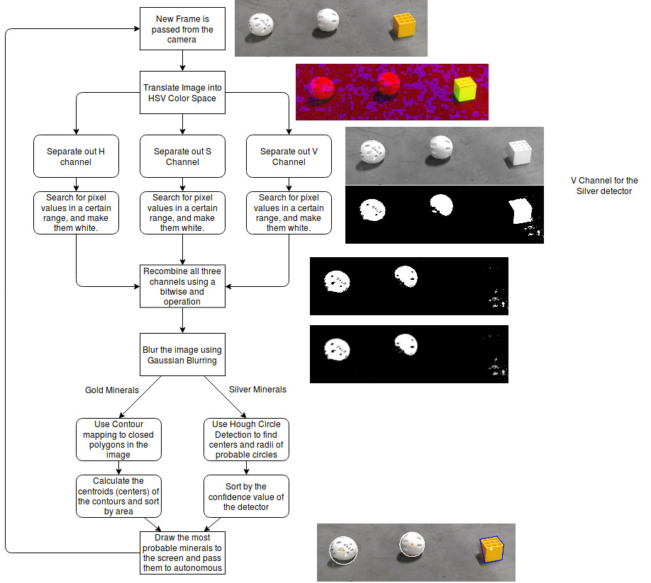

# Rover_Ruckus_Mineral_Detector

A Python based computer vision algorithm to detect minerals in the 2018-2019 FTC competition Rover Ruckus using OpenCV. The flowchart below details how the algorithm works.

